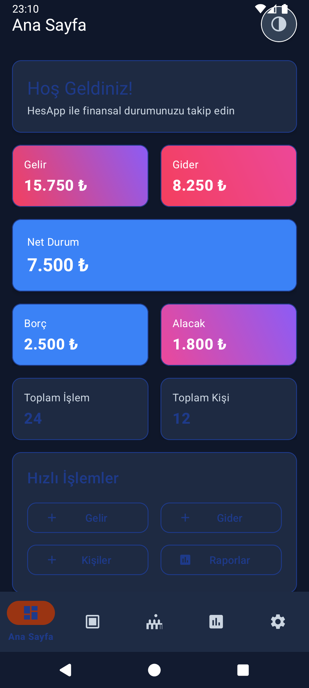
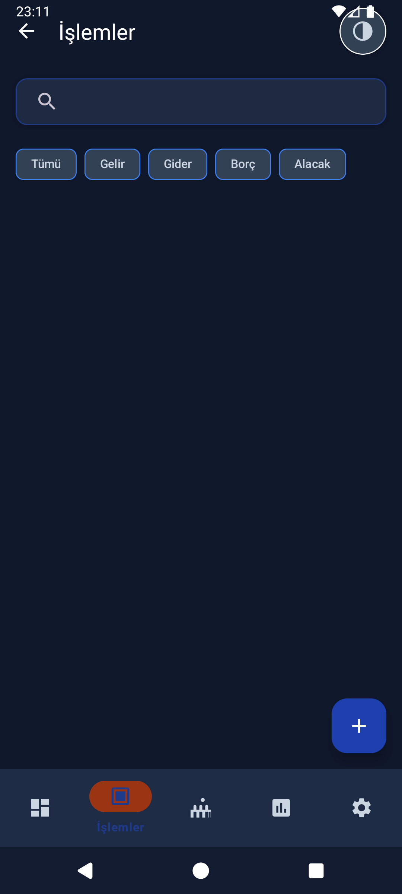
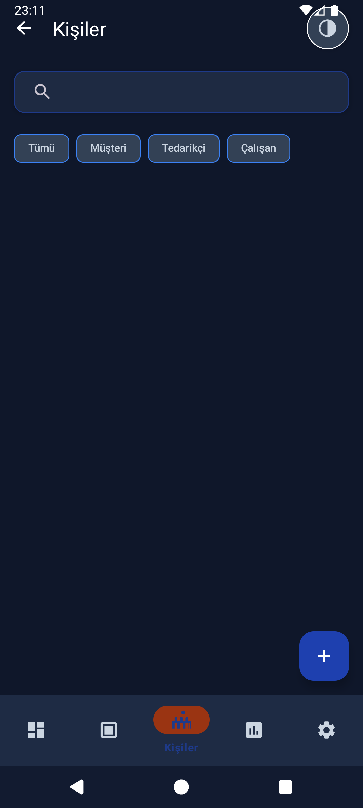

# 📱 HesApp Ekran Görüntüleri

Bu dosya, HesApp uygulamasının ekran görüntülerini içerir. Gerçek ekran görüntüleri alındığında bu dosya güncellenecektir.

## 📸 Ekran Görüntüleri

### Ana Sayfa (Dashboard)

### İşlemler Sayfası

### Kişiler Sayfası

### Raporlar Sayfası

### Ayarlar Sayfası

## 🎨 Tema Görüntüleri

### Aydınlık Tema

### Karanlık Tema

## 📱 Cihaz Görüntüleri

### Telefon

### Tablet

## 🎬 Animasyon Görüntüleri

### Fragment Geçişleri

### Tema Geçişi

## 📊 Özellik Görüntüleri

### İşlem Ekleme

### Filtreleme

### Arama

### İstatistikler

---

**Not:** Bu ekran görüntüleri uygulamanın gerçek durumunu yansıtmaktadır. Güncellemeler yapıldıkça bu görüntüler de güncellenecektir. 